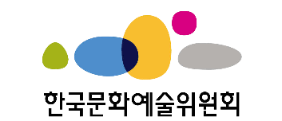

# AI School
* KICT 프로젝트반 - 두번째 프로젝트 [분야별 데이터 셋 분석하기]

    파이썬@ 
       <a href='https://www.facebook.com/dongjo.lim.7'>LDJ</a>
    , [임동조](frontierlim13@gmail.com)

<h2><b>데이터 사이언티스트 실무자</b></h2>

* 기술은 사람과 좋은 세상을 만드는 곳에 사용되어야 한다. 또한 그 과정 또한 선하고 정직해야 한다.

## Notice for Team Project

파일럿 프로젝트 진행(웹 데이터 수집 및 시각화, 데이터 분석)
* 기간 : 2022.10.06(목) ~ 2022.10.28(금)  
  * STEP 01. 프로젝트 주제 선정 및 일정 세우기 
  * STEP 02. 데이터 수집 및 처리/시각화/기본 모델 만들기 
  * STEP 03. 모델 개선/성능 개선 및 새로운 지식 익히기 
  * STEP 04. 최종 결과물 제출 - 2022.10.27(목) 22:00  
  * STEP 05. 프로젝트 발표 10.28(금)  
  
* 팀별 최종 발표    
  * 2022.10.28(금) 09:00~13:00 (각 개인별 발표 시간 10분 내외)

## Reference Documents

# 문서초안-세부 사항은 변경될 수 있음.
- Proj-01. [프로젝트 기획서 포맷      ][proj-01]
- Proj-02. [프로젝트 결과보고서 포맷   ][proj-02]

[proj-01]:  ./docu/Goorm10_프로젝트보고서_포맷_OOO팀.docx "Go proj-01"
[proj-02]:  ./docu/팀별프로젝트수행_결과작성양식_kdigital.pptx "Go proj-02"

##  Data Project

- <b>1st Subject </b>: <b> 우리의 관심 분야 데이터 수집/분석해보기 </b>
- <b>Our Motto   </b>: <b> 작은 태도, 작은 땀, 작은 노력이 모여 지금과 미래를 결정합니다. </b>
- <b>Report Format </b>: <a href="./docu/Goorm10_프로젝트보고서_포맷_OOO팀.docx">(샘플)프로젝트 보고서 양식</a>
- ※ 이미지를 클릭하면 결과물이 보입니다.

<table border=1 bgcolor="#EEEEEE">
	<tr bgcolor="#CC0000">
		<td width="100">
		
<b>Team Name</b>

		</td>
		<td width="100">
		
<b>Team Building</b>

		</td>
		<td width="300">
		
<b>Project Subject</b>

		</td>
		<td width="100">
		
<b>MyImage</b>

		</td>
		<td width="120">
		
<b>Reports</b>

		</td>
		<td width="120">
		
<b>Last Reports</b>

		</td>
	</tr>
	<tr>
		<td>
			
 팀명: 김현오   
				<b></b>
			

		</td>
		<td>
            		
김현오

        	</td>
		<td>
			
 표면 균열 검출 
</td>
		<td>
            		
     
            		

        	</td>
		<td>
            		
 
				<a href="./reports/Goorm2209_PilotProject_KimHO_v02.pdf">[프로젝트기획서]</a> &nbsp;&nbsp;&nbsp; 	
			

        	</td>
		<td>
            		
 
				<a href="결과링크">[우리의 작품]</a> 
				<a href=".">[Github 코드]</a> &nbsp;&nbsp;&nbsp; 
            		

        	</td>
	</tr>
	<tr>
		<td>
			
 팀명: 김태찬   
				<b></b>
			

		</td>
		<td>
            		
김태찬

        	</td>
		<td>
			
 -----------  
</td>
		<td>
            	
     
            	

        </td>
		<td>
            	
 
					<a href="./reports/Goorm2209_PilotProject_KimTC.pdf">[프로젝트기획서]</a> &nbsp;&nbsp;&nbsp; 	
					<a href="https://www.kaggle.com/datasets/jsphyg/weather-dataset-rattle-package">데이터 셋으로</a> &nbsp;&nbsp;&nbsp;
				

        </td>
		<td>
            	
 
					<a href="결과링크">[우리의 작품]</a> 
					<a href=".">[Github 코드]</a> &nbsp;&nbsp;&nbsp; 
            	

        </td>
	</tr>
	<tr>
		<td>
			
 팀명: 오동익   
				<b></b>
			

		</td>
		<td>
            
오동익

        </td>
		<td>
			
 American Express - Default Prediction  
</td>
		<td>
			
     
            

        </td>
		<td>
        	
 
				<a href="./reports/Goorm2209_PilotProject_OhDO.pdf">[프로젝트기획서]</a> &nbsp;&nbsp;&nbsp; 	
				<a href="https://www.bigdata-culture.kr/bigdata/user/data_market/detail.do?id=3076e909-db81-4e46-b2e5-f233e5613e97">데이터 셋으로</a> &nbsp;&nbsp;&nbsp;
			

        </td>
		<td>
			
 
				<a href="결과링크">[우리의 작품]</a> 
				<a href=".">[Github 코드]</a> &nbsp;&nbsp;&nbsp; 
			

        </td>
	</tr>
	<tr>
		<td>
			
 팀명: 임지윤   
				<b></b>
			

		</td>
		<td>
            
임지윤

        </td>
		<td>
			
 American Express - Default Prediction 

		</td>
		<td>
        	
     
			

        </td>
		<td>
            
 
				<a href="./reports/Goorm2209_PilotProject_LimJY.pdf">[프로젝트기획서]</a> &nbsp;&nbsp;&nbsp;
			

        	</td>
		<td>
            
 
				<a href="결과링크">[우리의 작품]</a> 
				<a href=".">[Github 코드]</a> &nbsp;&nbsp;&nbsp; 
            

        </td>
	</tr>
</table>

Goorm 인공지능 프로젝트 3기! 최고 멋진 친구들 화이팅!!!

##  Pilot Project : Final Report
- <b>Submission   </b>: 착수보고, 결과보고, 소스코드
- <b>Presentation </b>: 10min / team, Q&A
- <b>Keep in mind </b>: <b> Share Lessons Learned !! </b>

 &lt; The End &gt; 

